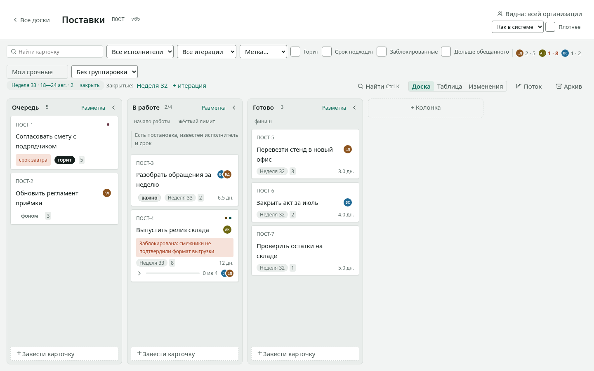

# Takt

**Канбан-доска с метриками потока для одной команды.** Ставится
в собственный контур: один процесс, одна база PostgreSQL, интернет
не нужен ни при установке, ни в работе.

[](https://github.com/findias/takt/actions/workflows/check.yml)
[](https://github.com/findias/takt/actions/workflows/security.yml)
[](LICENSE)

[English](README.en.md) · [Установка](docs/установка.md) ·
[Документация](docs/индекс.md) · [Требования](REQUIREMENTS.md) ·
[Что менялось](CHANGELOG.md) · [Как участвовать](CONTRIBUTING.md) ·
[Безопасность](SECURITY.md)

Takt — takt time, ритм, с которым работа выходит из потока. Названо
по тому, чем продукт отличается от списка задач: колонки размечены
для потока, и время цикла, пропускная способность и прогноз считаются
из этой разметки, а не из полей, заполненных вручную.



**Поставить** — [`docs/установка.md`](docs/установка.md): что для этого
нужно, docker compose, бинарник под systemd, чарт в Kubernetes,
закрытый контур, обновление и откат. **Пользоваться** —
[документация](docs/индекс.md). **Что продукт обязуется не сломать**
и чем каждое обещание закреплено — [`REQUIREMENTS.md`](REQUIREMENTS.md).

Ниже — то, что нужно знать, чтобы этот код править: что он умеет,
как устроен и почему устроен так.

Исследование рынка и обоснование архитектуры — в
[`research/kanban-research.html`](research/kanban-research.html).
Разбор устройства досок — в git-хостингах, в самом git и в чужих продуктах,
с выводами для нашей схемы — в
[`research/boards-research.html`](research/boards-research.html), выжимка
решений на одну страницу — в
[`research/schema-decisions.html`](research/schema-decisions.html).

## Быстрый старт

```bash
make stand     # база, миграции, демонстрационные данные, сборка фронтенда
make run       # приложение на http://localhost:8099
```

Вход в стенд: `anna@example.test` / `parol12345`. Данными наполняется
организация целиком — дерево подразделений, три доски всех видимостей,
карточки со всеми свойствами, итерации, архив и история на три недели
назад: на пустом интерфейсе не видно ни вёрстки, ни метрик.

Без данных, начисто:

```bash
make db        # PostgreSQL в docker на порту 55432
make web       # сборка фронтенда
make run       # приложение на http://localhost:8099
```

Ставить всерьёз — не отсюда: `make stand` сносит базу и наливает
выдуманные данные. Настоящая установка — в
[`docs/установка.md`](docs/установка.md).

## Что умеет

Полный список того, что продукт **обязуется не сломать**, вместе с файлом
проверки на каждое обещание — в [`REQUIREMENTS.md`](REQUIREMENTS.md).
Здесь — то же коротко.

- **Доска.** Колонки, карточки, перенос мышью и с клавиатуры (`Ctrl`
  со стрелками), ручной порядок. Перенос применяется мгновенно
  и переживает обрыв связи и перезагрузку страницы.
- **Поток.** Колонки размечены: вид (`queue`, `in_progress`, `done`),
  точки старта и финиша, политика входа. Отсюда время цикла, пропускная
  способность, накопление и прогноз с перцентилями — а не из глазомера.
- **WIP-лимит на колонку.** По умолчанию мягкий: превышение подсвечено,
  работать не мешает. Жёсткий включается флагом и отвечает `409`.
- **Итерации.** Заведение, закрытие, отчёт по закрытой.
- **Живое обновление.** Изменение доходит до всех, у кого доска открыта,
  без перезагрузки.
- **Архив.** Карточек и досок: убранное возвращается, удалённое
  насовсем — нет.
- **Организация.** Четыре роли, приглашения по ссылке, подразделения
  деревом, видимость досок по подразделениям, наблюдение за поддеревом.
  Изоляция организаций держится политиками базы, а не проверками в коде.
- **Вход.** По паролю и через корпоративного провайдера (OIDC).
  Заведение людей из каталога по SCIM.
- **Интеграции.** API с версией в адресе, кодами вместо текста
  и безопасным повтором; подписки на события с подписью и повторами;
  выгрузка всех данных организации одним файлом.
- **Доступность.** Всё делается с клавиатуры; контраст держит WCAG 2.2 AA
  в обеих темах; страница не листается вбок и не теряет содержимое при
  двойном размере текста.

## Чего продукт не делает

Отложенное перечислено в конце [`REQUIREMENTS.md`](REQUIREMENTS.md),
и у каждого пункта сказано, что снимет отсрочку. Коротко: вложений
в карточках нет, сроков и диаграммы Ганта не будет (это другой продукт),
публичного облака с самообслуживанием — тоже: установка предполагается
частной, и регистрация закрывается настройкой ровно поэтому.

Что из решений в схеме необратимо задним числом — в
[`research/schema-decisions.html`](research/schema-decisions.html).

## Устройство

```
cmd/takt/           единственный исполняемый файл: serve, migrate, doctor
internal/rank/      дробная индексация — строковые ключи порядка карточек
internal/board/     доменная модель доски и применение операций
internal/org/       организации, состав команды, приглашения
internal/auth/      личности, членство, сессии
internal/httpapi/   маршруты, доступ, раздача фронтенда
internal/store/     пул соединений, области видимости, миграции
migrations/         SQL, встроенный в бинарник
deploy/             инициализация базы
web/                React + TypeScript
```

Четыре решения в схеме необратимы задним числом и заложены до того, как
появились данные:

1. **`cards.position` — строковый ключ дробной индексации.** Перемещение
   карточки — один `UPDATE`, и два одновременных перетаскивания не ломают
   порядок. Алгоритм и его свойства — в `internal/rank`, с тестами.
2. **`card_events` — append-only журнал.** Cycle time, диаграмма потока и
   лента активности считаются из истории переходов. Восстановить её позже
   неоткуда.
3. **`org_id` в каждой таблице.** Сейчас бесплатно, потом — миграция всего.
4. **Точки старта и финиша на колонках.** Через них определены время цикла,
   возраст карточки и пропускная способность: без разметки журнал переходов
   копится, но не отвечает на вопрос «шла ли тогда работа». Разметить колонки
   можно когда угодно, ответить за прошлое — нет.

### Мультиарендность

Организация — это арендатор. Личность и участие разделены:

```
users        почта и пароль, глобально уникальные — это человек
memberships  кто в какой организации и с какой ролью — это участие
sessions     помнят, в какой организации человек работает сейчас
```

Роль (`owner`, `member`, `viewer`) — свойство участия, а не человека: один
и тот же сотрудник бывает владельцем своей команды и наблюдателем в чужой.
Попасть в организацию можно только двумя способами — создать её или принять
приглашение; вписать себя в чужую команду нельзя.

**Изоляция обеспечивается базой, а не кодом.** На всех таблицах с данными
включён Row-Level Security с политикой `org_id = app_current_org()`, где
`app_current_org()` читает настройку транзакции. Настройку выставляет
`store.BeginTenant`, и она транзакционная — соединение возвращается в пул
чистым.

Ключевое свойство: **без выставленного арендатора не видно ничего.**
`current_setting` возвращает NULL, сравнение даёт NULL, строка не проходит.
Забыть область — значит получить пустой ответ, а не чужие данные. Одного
забытого `where org_id = …` для утечки недостаточно.

> **Приложение не должно подключаться суперпользователем.** Для суперпользователя
> и для роли с `BYPASSRLS` политики не действуют вообще, и вся изоляция молча
> исчезает: запросы работают, просто отдают лишнее. Приложение проверяет это
> при старте и отказывается запускаться. Роль для подключения создаёт
> `deploy/postgres-init/10-app-role.sh`.

Приглашение — исключение из схемы: его открывают по секретной ссылке, когда
организация ещё неизвестна, а у человека может не быть аккаунта. Для него
заведена вторая политика, открывающая строку по хешу токена. Знание секрета
и есть право — ровно то, чем приглашение является. В базе хранится только
хеш, поэтому ссылку невозможно показать повторно.

### Подразделения

Команда может лежать внутри команды, до пяти уровней. Предел не из
осторожности: он превращает «сколько угодно предков» в массив известной
длины, по которому работает индекс. Linear ограничивает пятью, GitLab
допускает двадцать, но сам рекомендует не больше пяти и связывает глубину
с деградацией.

Дерево хранится дважды: `teams.parent_id` — источник истины,
`teams.ancestor_ids` — путь от корня до себя, пересчитываемый триггером.
Так сделал GitLab, заменив рекурсивные запросы на массив с GIN-индексом,
и по той же причине: рекурсивный запрос внутри политики планировщик не
сплющивает, а массив ложится в индексное условие.

Роль наследуется вниз и не понижается: состоящий в направлении состоит и
во всех отделах под ним. Правило «максимум из унаследованного»
предсказуемо, а «где-то ниже урезали» превращает разбор доступа в
раскопки. Так у всех, кто это реализовал.

### Видимость досок

Внутри организации видимость перестаёт быть плоской: доска бывает открытой
всем (`org`, значение по умолчанию), командной (`team`) или закрытой
(`private` — только поимённо). Область транзакции поэтому шире, чем
арендатор: `store.InTenant` выставляет и организацию, и человека, а
`store.InOrg` — только организацию, для служебных задач, у которых нет
действующего лица.

Наблюдение — строка в `observers`, а не признак у человека. Разница в том,
что признак неизбежно означает «вся организация»: у GitLab наблюдатель
сделан типом пользователя и поэтому видит весь инстанс, ограничить его
подразделением нечем. Строка с указанием команды открывает ровно одно
поддерево, без указания — всю организацию, а руководитель двух направлений
выражается двумя строками. Наблюдение ортогонально роли: «видит всё» и
«что меняет» — разные вопросы, иначе пришлось бы заводить
`owner-observer`, `member-observer`, `viewer-observer`.

Закрытая доска — единственное исключение из «видит всё», и оно намеренное.

### Журнал административных действий

На доске журналируется всё — `card_events` пишет каждое перемещение.
За её пределами до недавнего времени не журналировалось ничего: кто выдал
приглашение, кто поменял роль, кто перенёс отдел, кто сделал человека
наблюдателем. Эти вопросы задают при разборе инцидента, и задают их всегда
постфактум, поэтому `audit_events` — решение того же класса, что и сам
журнал переходов: либо пишется с начала, либо не существует.

Три свойства обеспечены базой, а не обещанием:

- **Пишет триггер, а не код.** Изменение, сделанное миграцией, скриптом
  или руками в `psql`, попадает в журнал наравне с пришедшим через API.
  Журнал, который ведёт приложение, молчит ровно в тех случаях, ради
  которых заводился.
- **Только дописывается.** Политик `update` и `delete` нет вовсе — значит,
  они запрещены по умолчанию, в том числе владельцу организации.
- **Подпись нельзя подделать.** Политика вставки требует, чтобы автор
  записи совпадал с личностью в области транзакции.

Секреты в журнал не попадают: хеш токена приглашения вырезается, потому
что политика открывает приглашение именно по хешу — знание хеша
равносильно знанию ссылки.

Действие без установленной личности записывается с пустым автором, а не
отвергается: журнал, роняющий обслуживание базы, снимут первым же
коммитом. Читают журнал владелец и наблюдатель всей организации.

Два свойства этой схемы неочевидны, и оба обеспечены базой:

- **Закрыть доску можно только вокруг себя.** Postgres проверяет политику
  `select` и на новом ряде тоже, поэтому перевести доску в состояние,
  в котором сам её не видишь, нельзя. Иначе доска осталась бы видна одним
  лишь вписанным, а исправить это было бы некому: редактировать невидимую
  доску не может никто, включая владельца организации.
- **Состав закрытой доски виден владельцу организации и самому
  участнику.** Список участников доски найма сам по себе сведения.

### Контракт операций

Клиент присылает намерение, а не вычисленное состояние:

```
POST /api/boards/{id}/operations
  { "operationId": "…", "type": "MOVE_CARD",
    "payload": { "cardId": "…", "toColumnId": "…",
                 "place": "after", "afterCardId": "…" } }

→ 200 { version, patch }          применено
→ 409 { error, columnId, currentOrder, version }   конфликт
```

`place` принимает `start`, `end` или `after` (последнее — вместе с
`afterCardId`) и обязателен по смыслу: умолчания «по отсутствию поля»
означали бы в разных операциях разное.

`operationId` стабилен между повторами. Если ответ потерялся в сети,
повтор с тем же идентификатором вернёт сохранённый результат, а не создаст
вторую карточку.

Ответ `409` несёт текущий порядок затронутой колонки — клиент пересобирает
её точечно, без перезагрузки доски. Тем же `409` отвечает попытка положить
карточку в колонку с исчерпанным жёстким лимитом.

`UPDATE_COLUMN` меняет любое подмножество свойств колонки:

```
{ "type": "UPDATE_COLUMN",
  "payload": { "columnId": "…", "kind": "in_progress",
               "isStartedPoint": true, "policy": "…",
               "wipLimit": 3, "wipLimitHard": false } }
```

Не присланное поле не меняется. Для лимита это значит, что «не трогать» и
«снять» — разные намерения: снимает лимит только явный `null`.

## Интеграционное API

Описание контракта — на странице `/api/v1/docs` работающей установки;
машиночитаемое — `/api/v1/openapi.json`. Версия стоит в адресе, причина
отказа приходит кодом, повтор с тем же ключом идемпотентности безопасен.

## Разработка

```bash
make check              # формат, vet, все тесты кроме сквозных и нагрузочных
make e2e                # сквозные сценарии в настоящем браузере (нужен Chrome)
make load               # поведение под нагрузкой, идёт минуты
make security           # уязвимости зависимостей и статический разбор
make web-dev            # Vite с горячей перезагрузкой на :5173
make build              # бинарник в bin/takt
make image              # docker-образ takt:dev (BASE=alpine|debian)
make images             # образы на обоих основаниях
make bundle             # комплект для установки без доступа в интернет
```

`make check` обязан проходить и в закрытом контуре — поэтому проверок,
которым нужна сеть, в нём нет.

Версию во все три сборки передаёт `git describe`, а не файл: файл
в образе можно подменить, а версия обязана быть тем же артефактом, что
и код. Как собрать образ вручную и чем это грозит, если забыть версию, —
в [`docs/установка.md`](docs/установка.md).

Тесты операций работают против настоящей базы: почти вся их логика живёт в
SQL и транзакциях, и подменять их заглушками — значит проверять заглушки.
Поэтому `go test ./...` без базы падает нарочно: прогон без неё однажды
напечатал «ok» у каждого пакета, пропустив 248 проверок из 259. Либо база
задана (`make check` задаёт её сам), либо прогон объявлен коротким:
`go test -short ./...`.

Как здесь принято править и как прислать патч —
в [`CONTRIBUTING.md`](CONTRIBUTING.md).

## Как участвовать

Порядок — в [`CONTRIBUTING.md`](CONTRIBUTING.md); коротко: правку
больше опечатки стоит сперва обсудить, потому что часть отказов —
решения с записанным доводом, а не пробелы. Как здесь разговаривают —
в [`CODE_OF_CONDUCT.md`](CODE_OF_CONDUCT.md).

Об уязвимости — **не публичной задачей**, а приватно:
[`SECURITY.md`](SECURITY.md) говорит куда и чего ждать в ответ.

## Лицензия

Apache License 2.0 — [`LICENSE`](LICENSE). Кратко: пользоваться, менять
и распространять, в том числе в закрытом продукте, можно; менять и
распространять — сохраняя уведомление об авторстве и оставляя
[`NOTICE`](NOTICE) с продуктом; патентная лицензия даётся и отзывается
у того, кто пойдёт судиться о патентах. Гарантий нет.

Заголовков с лицензией в файлах нет намеренно. Apache-2.0 их не требует,
а восемьсот одинаковых шапок делают ровно одно: отодвигают комментарий,
объясняющий, почему код такой, на пятнадцать строк ниже. Лицензия одна
на весь репозиторий, и она в корне.

Чужой код, который едет вместе с продуктом, перечислен
в [`THIRD-PARTY.md`](THIRD-PARTY.md) — только тот, что попадает
в бинарник и в собранный клиент, без инструментов сборки. Список
не переписывается руками задним числом: проверка `internal/license`
берёт то, что линкуется в `cmd/takt`, и требует строку на каждый модуль.
