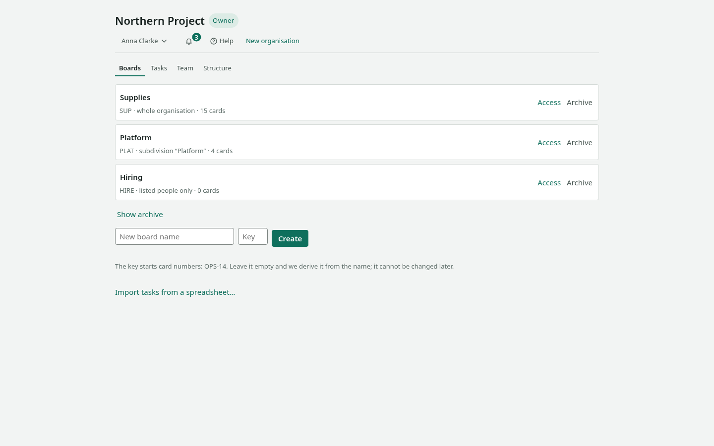
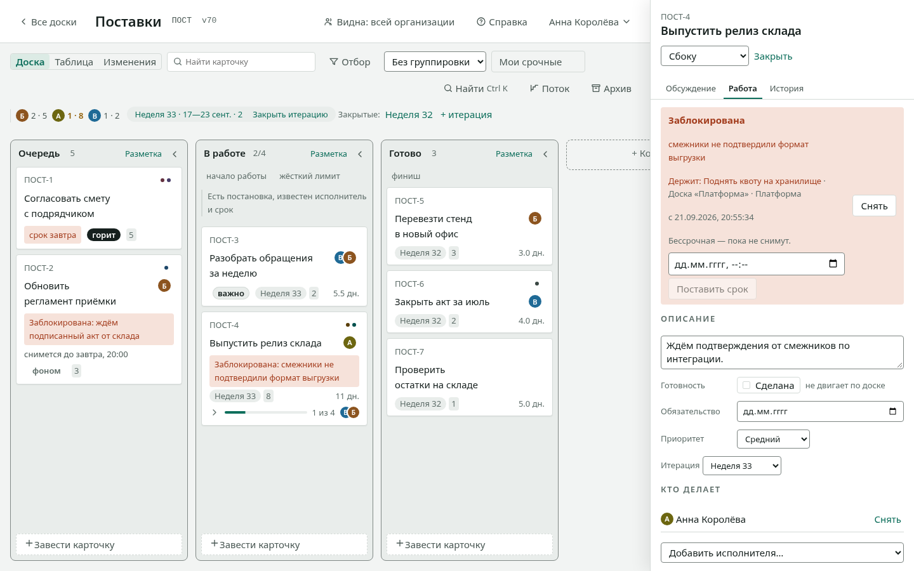

# First fifteen minutes

Walk this path once and the board will stop needing explanations. We
will create a board, put work on it, carry that work to the end, and
invite a colleague.

You need a board open in a browser and fifteen minutes.

**The interface speaks English and Russian;** the language is chosen
behind your name in the header. Buttons are named here as they appear
in the English interface. Screenshots still show the Russian one.

<!-- anchor: create-board -->
## 1. Create a board

1. On the main screen, type a name into **New board name**.
2. Next to it, in **Key**, type a short word — `ПОСТ`, say. It
   becomes the prefix of card numbers: ПОСТ-1, ПОСТ-2. Leave it empty
   and we derive it from the name.
3. Press **Create**.

The board opens straight away with three columns: **Queue**,
**In progress**, **Done**. Those are stages of work,
and you can change them.

## 2. Put work on it

1. At the bottom of **Queue**, press **Create card**.
2. Write what needs doing and press `Enter`.

Create three or four cards: with one, the board shows nothing.

## 3. Move a card

Drag a card into **In progress**. Or, faster: focus it from the keyboard
and press `Ctrl` with the right arrow.

The card flashes in its new place — that is how the board shows where
it went. Everyone with this board open sees the change immediately.

<!-- anchor: describe-work -->
## 4. Describe the work

1. Click the card's title; a panel opens.
2. Go to the **Work** tab.
3. Assign an owner, set an estimate and a due date.

If work has stalled, press **Block** and write the
reason. The reason shows on the board itself: "blocked" with no
explanation answers no question at all. If you know when the wait
ends, fill in **Lifts itself (optional)** — the block lifts
itself at that moment.

To mark what kind of work it is, add a label: press **+ label** on the
card and type. A label that does not exist yet is created right there —
for this board, a subdivision, or the whole organisation.

## 5. Carry it to the end

Move the card into **Done**. After a few such cards, open **Flow**
in the board header: cycle time, throughput and a forecast
appear there. The metrics are computed from what you have already
done — nothing to invent.

## 6. Invite a colleague

1. Open the **Team** tab.
2. Under **Invite**, enter an e-mail and pick a role.
3. Press **Invite** and send the link that appears.

The link is addressed: someone with a different e-mail cannot accept
it. It is shown once — only a fingerprint of it is stored.

## What next

- Solve a specific problem — [How to](howto.md).
- See everything as a list — [Reference](reference.md).
- Understand why the board works this way — [Design
  decisions](architecture.md).
