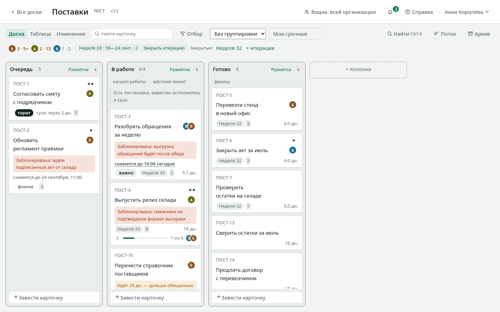

# Доска

Канбан-трекер для команды: работа на доске, метрики потока,
организация с ролями и подразделениями, интеграции. Ставится
в собственный контур — облака и внешних служб не требует.

## С чего начать

| Вам нужно | Откройте |
| --- | --- |
| Научиться вести доску | [Первые пятнадцать минут](старт.md) |
| Решить конкретную задачу | [Как сделать](как.md) |
| Посмотреть списки и настройки | [Справочник](справочник.md) |
| Понять, почему сделано так | [Устройство](устройство.md) |
| Поставить и обслуживать | [Установка](установка.md) |
| Пройти проверку ИБ | [Проверка ИБ](проверка-иб.md) |
| Read in English | [Overview](../overview.md) — и весь набор рядом |

Разделение не случайное: обучение, инструкция, справка и объяснение
отвечают на разные вопросы, и смешанные в одном тексте они мешают
друг другу. Учиться удобно последовательно, задачу решать — точечно,
справку читать — таблицей.

## Что продукт делает

**Доска.** Колонки-стадии, карточки-работа, ручной порядок. Перенос
мышью и с клавиатуры. Лимиты колонок и правила входа; ширину колонки
тянут мышью. Блокировка с причиной — и, если нужно, со сроком, в который
она снимется сама. Метки организации, подразделения или одной доски:
каждая говорит, откуда она, а недостающую заводят прямо с карточки.
Подзадачи и связи между карточками — в том числе между
досками разных команд.

**Три вида на одни данные.** Доска отвечает «как идёт работа»,
таблица — «где самое старое и что мы обещали», лента изменений — «что
происходило».

**Отбор и группировка.** Девять условий отбора, четыре разреза
дорожками, сохранённые виды. Всё живёт в адресе: настроенный вид
присылают ссылкой.

**Метрики потока.** Время цикла перцентилями, пропускная способность,
работа в процессе, возраст идущего, накопление, вероятностный прогноз.
Считаются из выполненной работы, а не из заполненных вручную полей.

**Итерации.** Спринт или релиз со сроком и отчётом по закрытии.

**Организация.** Роли, подразделения деревом, три вида видимости
досок, приглашения по ссылке, журнал административных действий.

**Переезд.** Из таблицы (CSV, Excel), прямо из YouGile или — в закрытый
контур — пакетом: отдельный выгрузчик [`takt-fetch`](выгрузчик.md)
собирает его снаружи из YouGile, Jira, Kaiten или monday вместе
с подзадачами, связями и обсуждением. Всякий перенос сперва показывает,
что будет, и называет то, что перенести не может.

**Интеграции.** REST с описанием контракта, ключи с разрешениями,
каталог SCIM 2.0, подписки на события с подписью и журналом доставок,
выгрузка всех данных одним файлом.

**Вход.** Пароль или корпоративный провайдер (OIDC).

## Чего продукт не делает

Сроков как графика и диаграмм Ганта, публичного облака
с самообслуживанием, вложений в карточках. Это не недоделки:
у каждого отказа записан довод, а у части — условие, при котором
он будет пересмотрен. Полный список — в
[требованиях](../../REQUIREMENTS.md).

## Как это ставится

Один образ, одна база PostgreSQL. Разворачивается через `docker
compose` на одной машине или чартом в Kubernetes; комплект для
закрытого контура собирается одной командой и увозится файлом.
Интернет не нужен ни при установке, ни в работе.

Подробности — в [руководстве по установке](установка.md); что именно
продукт обязуется не сломать — в [требованиях](../../REQUIREMENTS.md);
что менялось между версиями — в [списке изменений](../../CHANGELOG.ru.md).

<!-- перевод: docs/overview.md sha256:99117341fe6f -->
