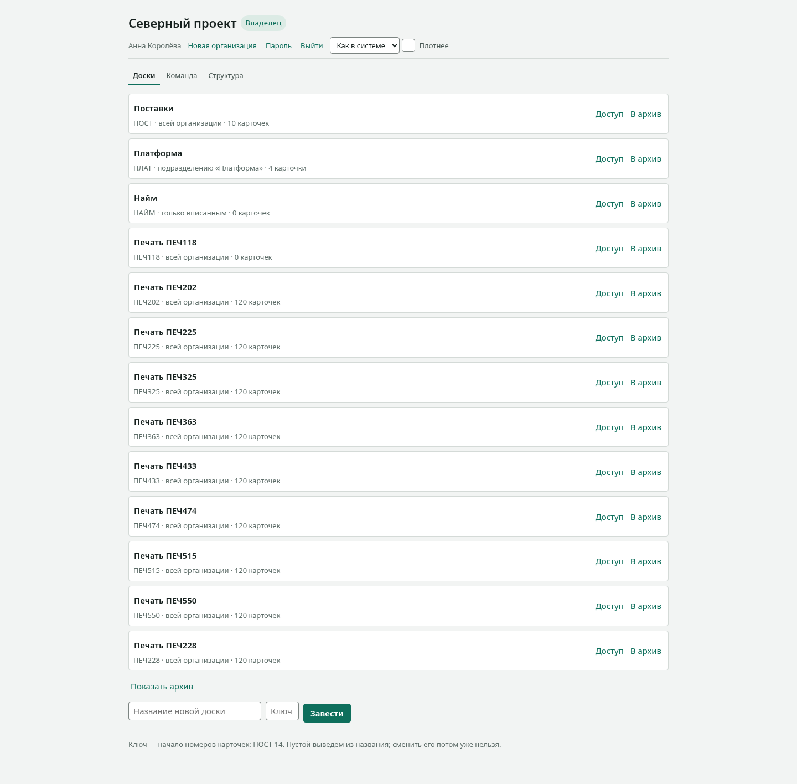

# Первые пятнадцать минут

Пройдите этот путь один раз — и дальше доска не будет требовать
объяснений. Мы заведём доску, поставим на неё работу, проведём её
до конца и позовём коллегу.

Вам понадобится открытая доска в браузере и пятнадцать минут.

## 1. Заведите доску

1. На главном экране введите название в поле **«Название новой доски»**.
2. Рядом, в поле **«Ключ»**, введите короткое слово — например, `ПОСТ`.
   Оно станет началом номеров карточек: ПОСТ-1, ПОСТ-2. Оставите
   пустым — выведем из названия.
3. Нажмите **«Завести»**.

Доска откроется сразу. В ней уже есть три колонки: «Очередь»,
«В работе», «Готово». Это стадии работы, и их можно менять.

## 2. Поставьте работу

1. Внизу колонки «Очередь» нажмите **«Завести карточку»**.
2. Напишите, что нужно сделать, и нажмите `Enter`.

Заведите три-четыре карточки: на одной доска ничего не показывает.

## 3. Перенесите карточку

Возьмите карточку мышью и перетащите в «В работе». Или, что быстрее:
встаньте на неё с клавиатуры и нажмите `Ctrl` со стрелкой вправо.

Карточка вспыхнет на новом месте — так доска показывает, куда она
уехала. Изменение сразу увидят все, у кого открыта эта доска.

## 4. Опишите работу подробнее

1. Щёлкните по названию карточки — откроется панель.
2. Перейдите на вкладку **«Работа»**.
3. Назначьте исполнителя, поставьте оценку и срок.

Если работа встала — нажмите **«Заблокировать»** и напишите причину.
Причина будет видна прямо на доске: «заблокирована» без объяснения
не отвечает ни на один вопрос.

## 5. Доведите до конца

Перенесите карточку в «Готово». Через несколько таких карточек
откройте **«Поток»** в шапке доски: там появятся время цикла,
пропускная способность и прогноз. Метрики считаются из того, что вы
уже сделали, — придумывать ничего не нужно.

## 6. Позовите коллегу

1. Откройте вкладку **«Команда»**.
2. В разделе **«Пригласить»** введите почту и выберите роль.
3. Нажмите **«Пригласить»** и отправьте появившуюся ссылку.

Ссылка адресная: человек с другим адресом её не примет. Показывается
она один раз — в базе хранится только отпечаток.

## Что дальше

- Решить конкретную задачу — [«Как сделать»](как.md).
- Посмотреть все возможности списком — [«Справочник»](справочник.md).
- Понять, почему доска устроена именно так, — [«Устройство»](устройство.md).

<!-- перевод: docs/quickstart.md sha256:baa099f05c53 -->
